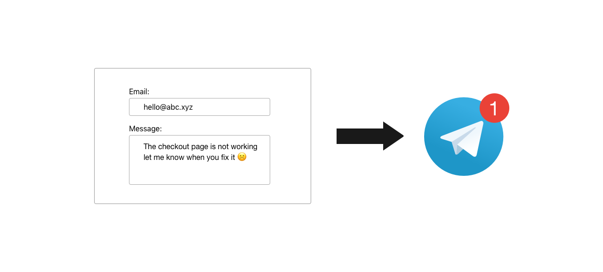
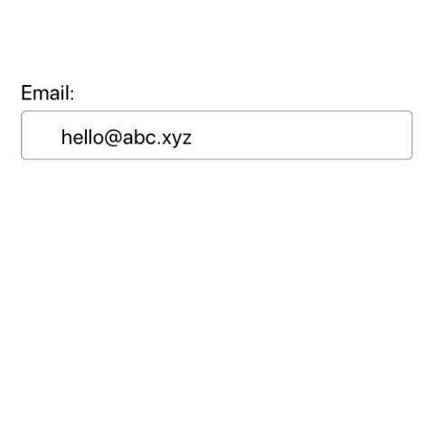

A little more than two months ago [Konstantin](https://twitter.com/kpavlovsky_pro) asked me how long would it take for me to develop something that would let him receive forms on his website as Telegram messages.

I wasn't sure how long it would take, but finding the task interesting I decided to just do it.

In an afternoon of work I made the first version of "Dripform".

After making it I started exchanging ideas via email with [Marc-Antoine](https://twitter.com/marcantoinefon) who is working on a similar product. (btw Marc thanks for correcting my messages in french)

For around a month I never found enough time to finalise the project and didn't think that much about it.

When I finished my last exam though I finally spent a night preparing for the launch, making Gifs:

####First attempt

####Final Version

### The Product
For this product I decided I wanted to keep everything as simple as possible and avoid over-engineering.

So the stack of the project is pretty straightforward to understand.

For the back end I used an express/node server to handle the api requests and a high level telegram library to handle messaging.

The front end is just plain html/css with a sprinkle of javascript, no frameworks. I tried to keep everything as simple as possible. **I wanted the website to give the vibe of the product, which is simple, yet fast and elegant.**

The website is served using nginx on a Ubuntu Linode instance. The setup of the server was probably the most painful part in the development process as I was used to building node apps with [zeit.co](https://zeit.co) that automates most of the things I had to handle.

Building the website didn't take me a lot of time, in fact I spent most of my time refining the details and problems as they came up using it.

### The Launch
After getting the first users through the Solo Founders Telegram group a couple of weeks ago, I decided to launch on Product Hunt, even if I was leaving on the day of the launch and couldn't spend much time on promotion.

To prepare for the launch [Sergio](https://twitter.com/matteing) sent me a link to [Andrey Azimov](https://twitter.com/AndreyAzimov)'s latest product [Preview Hunt](https://previewhunt.com) which turned out to be extremely useful.

## The Result
I managed to gather more than 100 upvotes and to be on the front page which converted to many users.
What I learned from the last launch was that making good products is possible, from this one I wanted to have as many users as possible and get as many people as possible to use my product.

In the weeks following the launch I wasn't able to answer all of the feedback I received (hundreds of messages) as I was offline for a couple of weeks, working and traveling in Paris and Burgundy.

Extra Credits and thanks to [Konstantin](https://twitter.com/kpavlovsky_pro), [Marco](https://twitter.com/enthusiausted) and [Kaspar](https://twitter.com/pyyding) that helped me make important decisions for the product.

You can check it out at: [Dripform](https://dripform.ga)

And on Product Hunt:
<iframe style="border: none;" src="https://cards.producthunt.com/cards/posts/131617?v=1" width="500" height="405" frameborder="0" scrolling="no" allowfullscreen></iframe>