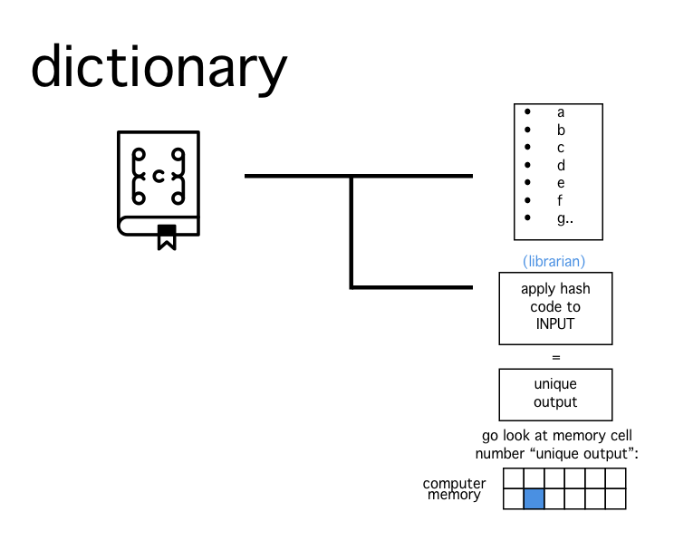
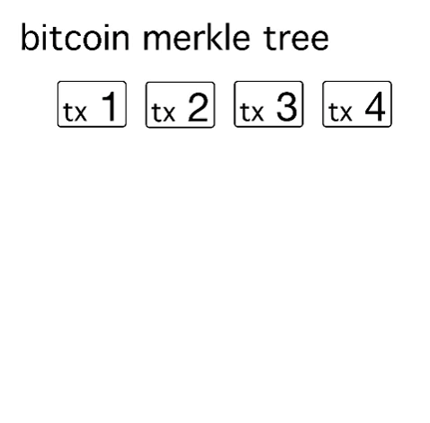
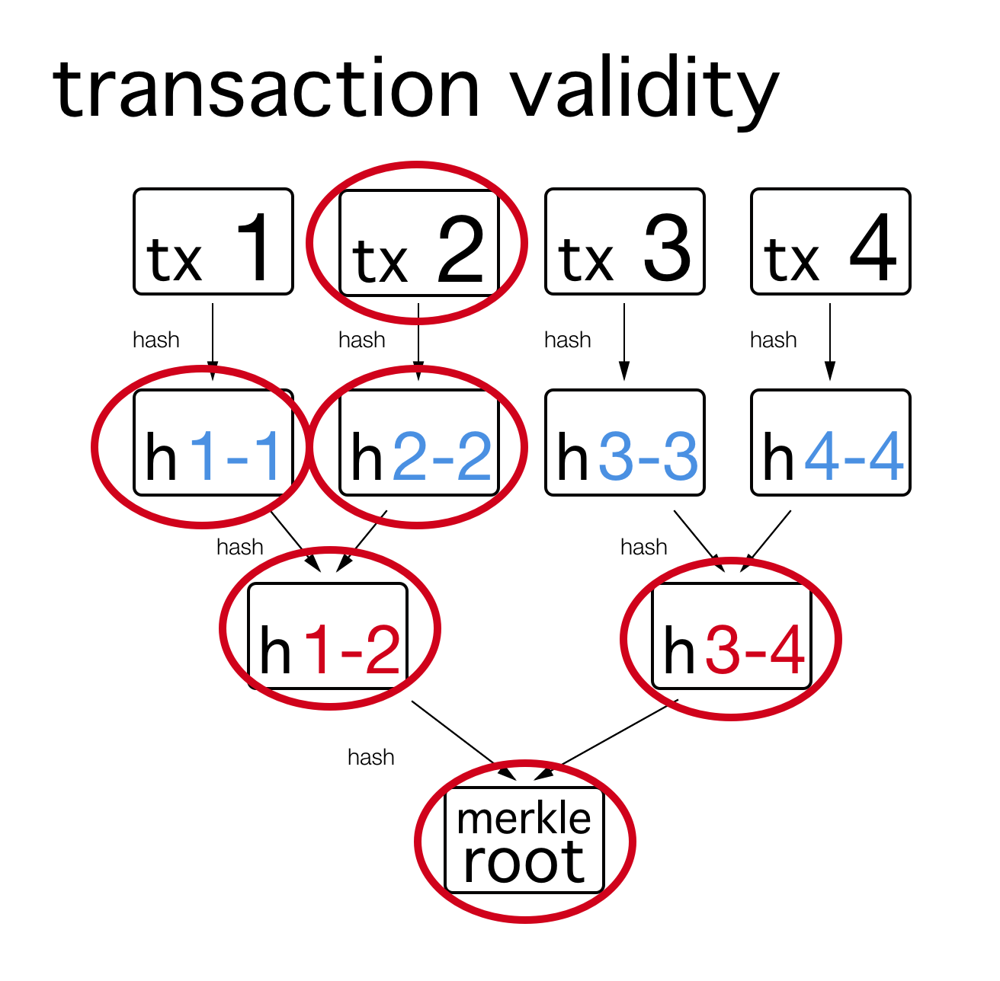

As the term crypto, is now widely used to refer to cryptocurrencies I thought it would be interesting to write a simple blog post explaining the cryptography behind Bitcoin, which is one of the many layers of the digital gold we all love.

## Hashing Algorithms

A hashing algortihm is a code used to uniquely map objects.
The main reason hashing algorithms were introduced was that if in a program you want to look for a value it makes no sense to check all existing values to find what we need.

**How do they work ?**

Imagine an enourmous library that has a librarian that for every book can tell you its unique position.

In programming if we didn't have hashing functions we would have to sift through everything we have saved on our computers and check if it's what we're looking for:

With hashing functions we can find or know that we don't have what we need in only one step, whatever the size of our "library".

In Bitcoin there are two hashing functions used: SHA256 and RIPEMD-160.
Here's the output of SHA256 when the input is "bitcoin": 
`6b88c087247aa2f07ee1c5956b8e1a9f4c7f892a70e324f1bb3d161e05ca107b`

In Bitcoin generally the SHA256 is applied twice:

Initial input:
`bitcoin`

Output of first round of SHA256 on "bitcoin":
`6b88c087247aa2f07ee1c5956b8e1a9f4c7f892a70e324f1bb3d161e05ca107b` 

Output of second round of SHA256 on "6b88c087247aa2f07ee1c5956b8e1a9f4c7f892a70e324f1bb3d161e05ca107b":
`a23b7f87e4250b3a64b737f349c06422f752f419cbb25ae9169a6cf1e23f4462` 

When we want to get a shorter output from our hashing function, like when a Bitcoin address is created the RIPEMD-160 hash function is used in the second round:

Initial input:
`bitoin address`

Output of SHA256 on "bitcoin address":
`338fc17627ab215e5cb0c4ef807dfd161ef96febdb00e997c50db5f4bf76f383`

Output of RIPEMD-160 on "338fc17627ab215e5cb0c4ef807dfd161ef96febdb00e997c50db5f4bf76f383":
`edb33402f008c1fed31f57f625aa30403f3a9b33`

## Merkle Tree

A Merkle Tree is a signature of all the transactions contained in a block.

Step 1) hash all the transaction.
Step 2) pair the hashes and hash together
Step 3) if you have more than 1 element left repeat step 2
Step 4) you now have the merkle root

If you change the value of the transaction in a block, the merkle root changes.
For this reason if you want to verify the validity of a transaction you can simply check the validity of the branch on which a transaction is on:

## 